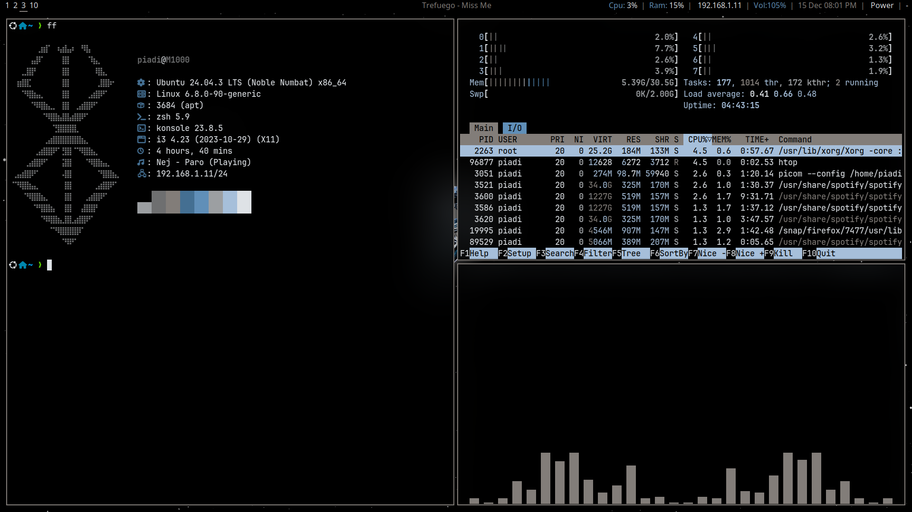

# My Personal i3 Dotfiles

This repository contains my **personal dotfiles for the i3 window manager**. These configurations reflect my daily setup and preferences for a productive and minimalistic Linux environment.

I also have a separate repository containing a **C script for automatic tiling**, which I use alongside these dotfiles. You can find it [here](https://github.com/piadi-sudo/i3-autotiling-in-c).

I’ve included a few screenshots below to showcase my setup.

## Screenshots

---

Feel free to explore and adapt these dotfiles for your own i3 setup.
